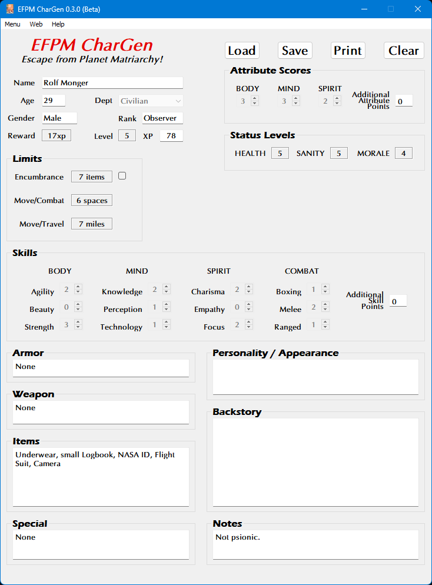

**Planet Matriarchy RPG Character Generator**
=============================================

.. figure:: images/efpm.png

**Planet Matriarchy RPG Character Generator** is a Windows program for creating characters using the Total Party Skills system.

Notes
-----

**Planet Matriarchy RPG Character Generator** is being developed using Python 3.11.4 and PyQt5.

Requirements
------------

* **Windows 10**

  It has not been tested in Windows 11.

* **Python 3.11.4**
   
  This code was written using the C implementation of Python
  version 3.11.4. Also known as CPython.
   
* **PyQt5 5.15.9**

  PyQt5 is the framework used for displaying the Window GUI and buttons, etc.

* **fpdf2 2.7.4**

  Fpdf2 is needed for printing the character sheets.

Not Using Python?
-----------------

You can always run the .EXE version for Windows 10 if you don't have the Python language installed.

.. |ss| raw:: html

    <strike>

.. |se| raw:: html

    </strike>

Things To-Do
------------

| Continue unifying the skills across all TPS genres.
| Instruction manual.
| Cheat codes.
|ss|

| EXE version needs to save PDFs.
| Move PDF character sheets closer to program folder.
| Add Encumbrance rules from Rocket Cadets in the 11th Dimension!
| Start on a To-Do.

|se|

**Known History**

* v0.1.4b

  The .EXE version can now save character sheets in PDF.

* v0.1.3b

  Updated to Python 3.11.0.

* v0.1.2b

  Moved the saving of PDF character sheets to the program folder.

* v0.1.1b

  Added ON/OFF toggle for Encumbrance.

The Escape from Planet Matriarchy! RPG was written by R. Joshua Holland.
Copyright 2021 - 2022, Total Party Skills.
https://www.drivethrurpg.com/product/371424/Escape-from-Planet-Matriarchy

Contact
-------

Questions? Please contact shawndriscoll@hotmail.com
